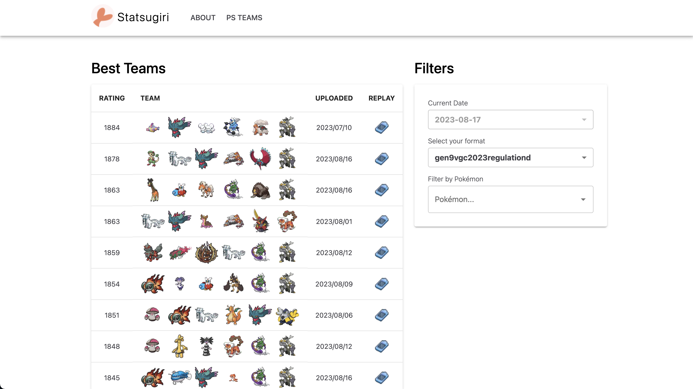

# Statsugiri

Statsugiri is a data platform focused on accessible and interpretable competitive Pokémon analytics. See [StatsugiriInfra](https://github.com/Statsugiri/StatsugiriInfra) for infrastructure deployment. Please follow [@Statsugiri](https://twitter.com/Statsugiri) on Twitter for updates.

### Contribute to Statsugiri

The `Statsugiri` team welcomes developer contributions and feature requests.

-   Contact [@NotCelsiusDeg](https://twitter.com/NotCelsiusDeg) for contributing / feature requests
-   Create a new [issue](https://github.com/Statsugiri/Statsugiri/issues) for feature requests with the `feature request` tag

# Statsugiri Usage

Learn more on the [Statsugiri Wiki](https://github.com/Statsugiri/Statsugiri/wiki) under the `Usage` section. API endpoints can be reached at `https://api.statsugiri.gg/`.

# Licensing

Statsugiri is licensed under the [BSD 3-Clause](https://github.com/Statsugiri/Statsugiri/blob/master/LICENSE).
