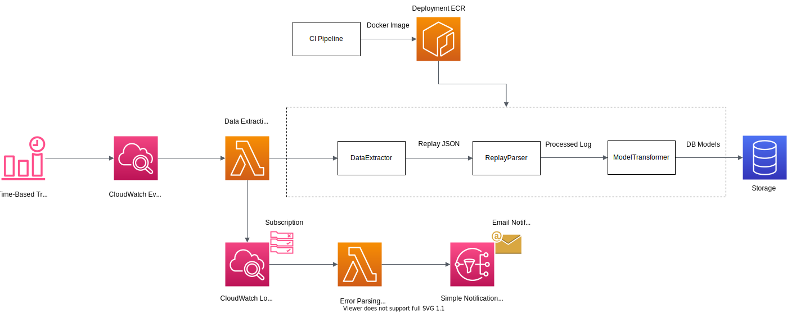

# Data Pipeline Architecture

babiri.net's data pipeline (known as [Drilbur](<https://bulbapedia.bulbagarden.net/wiki/Drilbur_(Pok%C3%A9mon)>)) extracts and processes ranking and replay data from [Pokémon Showdown](https://pokemonshowdown.com/).

# Table of Contents

TODO

# Architecture

#### Architecture Overview Diagram

The core components of the data pipeline are the [DataExtractor](#DataExtractor), [ReplayParser](#ReplayParser), and [ModelTransformer](#ModelTransformer). The `DataExtractor` is responsible for retrieving replay logs from ranked users. The `ReplayParser` is responsible for cleaning and processing the replay logs. The `ModelTransformer` creates database models from the processed logs.

The Data Extraction Lambda is scheduled to run every 24 hours using CloudWatch. CloudWatch is also responsible for monitoring errors from the Data Extraction Lamba logs. Simple Notification Service (SNS) will notify the user via email. The Data Extraction Lambda builds are updated through Elastic Container Registry (ECR) deploying the Docker image.

## DataExtractor

## ReplayParser

## ModelTransformer
