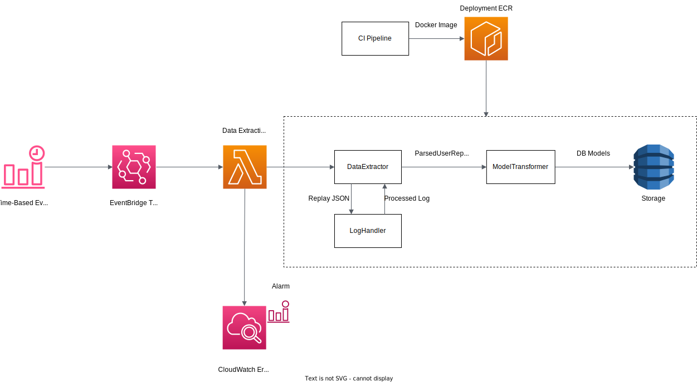

# Data Pipeline Architecture

The data pipeline (known as [Drilbur](<https://bulbapedia.bulbagarden.net/wiki/Drilbur_(Pok%C3%A9mon)>)) extracts and processes ranking and replay data from [Pokémon Showdown](https://pokemonshowdown.com/).

# Architecture

#### Architecture Overview Diagram

The core components of the data pipeline are the [DataExtractor](#DataExtractor), [LogHandler](#LogHandler), and [ModelTransformer](#ModelTransformer). At a high level, the responsibilities are as follows:

-   `DataExtractor` is responsible for retrieving replay logs and orchestrating data extraction.
-   `LogHandler` is responsible for cleaning and processing replay logs.
-   `ModelTransformer` creates database models from the information provided by `DataExtractor`.

### Infrastructure

The Data Extraction [Lambda](https://aws.amazon.com/lambda/) is scheduled to run every 24 hours using [CloudWatch](https://aws.amazon.com/cloudwatch/). CloudWatch is also responsible for monitoring errors from the Data Extraction Lamba logs. [Simple Notification Service](https://aws.amazon.com/sns/?whats-new-cards.sort-by=item.additionalFields.postDateTime&whats-new-cards.sort-order=desc) (SNS) will notify the user via email. The Data Extraction Lambda builds are updated through [Elastic Container Registry](https://aws.amazon.com/ecr/) (ECR) deploying the Docker image after pushes to the main branch.

### Main Modules

## DataExtractor

The `DataExtractor` ingests, parses, and extracts replay data. The main function, `extract_info`, retrieves the current users and ratings from the [ranking ladder](https://pokemonshowdown.com/ladder). The module searches through each set of public replays available from the highest-rated user and retrieves the replay log from the most recent of the format. The replay logs are handed to the `LogHandler` for processing, which are used to populate the [`ParsedUserReplay`](#ParsedUserReplay) list. Details about `ParsedUserReplay` can be found in [`ReplayMetadata`](#ReplayMetadata).

## LogHandler

The `LogHandler` processes replay logs. Replay data is ingested through `feed_log`, which sanitizes the log (ie. Handling alternate-form Pokémon). Information such as teams and items can be parsed with regular expressions. The `DataExtractor` leverages `LogHandler` processing for `ParsedUserReplay` objects.

## ModelTransformer

The `ModelTransformer` is transforms the `ParsedUserReplay` list from `DataExtractor` into the database model representations to be used. The models feature a `make_model` method to restructure them into a dictionary for the NoSQL database. Details about the output models can be found in [`Models`](#Models).

## ReplayMetadata

### ParsedUserReplay

`ParsedUserReplay` is the internal format of how replays information is stored after processing the replay logs in `DataExtractor`. It organizes specific information parsed from the logs (eg. teams) for each replay processed. `ParsedUserReplay` is read by the `ModelTransformer` to populate the database snapshot models.

## Models

### PokemonTeamsSnapshot

`PokemonTeamsSnapshot` represents the daily snapshot of publicly available teams. Data for each team includes the roster, rating and replay upload date.

### PokemonUsageSnapshot

`PokemonUsageSnapshot` features the following metrics:

-   The number of appearances for each Pokémon
-   The top partners for each Pokémon
-   The normalized rating to number of appearances for each Pokémon
