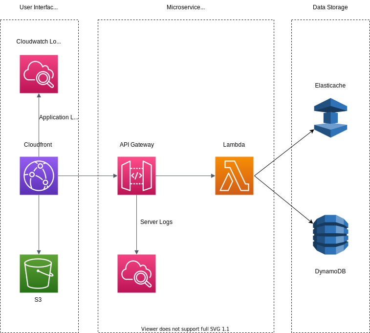

# Infrastructure Architecture

The infrastructure is hosted using [Amazon Web Services](https://aws.amazon.com/) (AWS) and their various cloud computing services.

#### Infrastructure Overview Diagram

The architecture is primarily hosted with serverless AWS services. [Cloudfront](https://aws.amazon.com/cloudfront/) and [S3](https://aws.amazon.com/s3/) are responsible for serving front-end content. [API Gateway](https://aws.amazon.com/api-gateway/) and [Lambda](https://aws.amazon.com/lambda/) facilitate the microservices and interface with the [DynamoDB](https://aws.amazon.com/dynamodb/) storage. [Cloudwatch](https://aws.amazon.com/cloudwatch/) maintains all logging.
